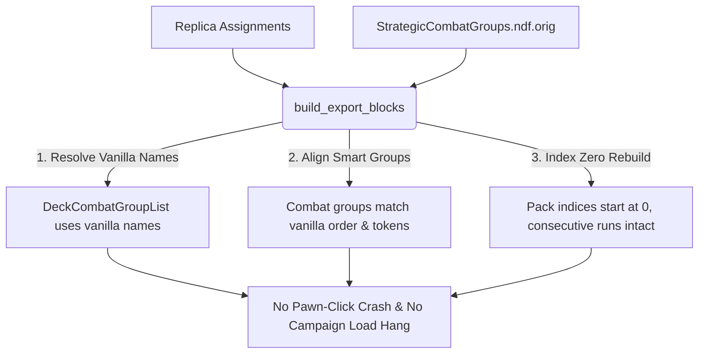

# Antigravity Analysis: Resolving the Army General Campaign Hang

This analysis document explains the root cause of the infinite loading screen hang in the WARNO Army General campaign map and outlines the exact changes required to resolve it.

---

## 1. Root Cause Analysis

### The Symptoms
- The mod compiles successfully and parses without syntax errors.
- Single-player/Skirmish or Custom battles work, but loading the Army General campaign results in a **permanent hang/infinite loading screen** (no immediate crash, just infinite loop).

### The Underlying Engine Constraint
The WARNO campaign engine stores map state (pawns representing units on the strategic map) in a baked database. 
1. These pawns are directly associated with **vanilla combat group descriptor names** (e.g., `Descriptor_CombatGroup_pion_US_11ACR_1_A_1_11th_ACR`).
2. When the campaign map loads, the engine tries to find these vanilla combat group descriptors within the deck's `DeckCombatGroupList` in `StrategicDecks.ndf`.
3. In the recent redesign, the export tool wiped vanilla lists and generated new, WIF-prefixed combat groups (e.g., `Descriptor_CombatGroup_US_11ACR_1_WIF_A`).
4. Because the campaign pawn objects still point to the vanilla names, the engine cannot resolve the pawn-to-deck mappings. The game enters an infinite loop trying to resolve the missing groups, causing the load-screen hang.

---

## 2. Solution Strategy: Unified Alignment

To fix the hang without re-introducing the crash-on-click bug, we must combine the **full-replacement pack list** with **vanilla descriptor naming and structure alignment**.



### The Three Golden Rules of Alignment
1. **Vanilla Combat Group Descriptors**: The exported combat groups must retain their vanilla names (e.g., `Descriptor_CombatGroup_pion_US_11ACR_1_A_1_11th_ACR`). The parser will find and replace these definitions in-place inside `StrategicCombatGroups.ndf`.
2. **Vanilla Smart Group Tokens**: The smart groups within each combat group must align with vanilla smart group tokens and order. If a vanilla deck has slots that are empty in the WIF replica, they must be filled with **empty placeholders** to preserve the sequence.
3. **Full-Replacement Packs from Index Zero**: The deck's `DeckPackList` is completely rebuilt from index 0. The smart groups point to these new pack indices, utilizing the duplicate pack count fix `(start_index, count)` to ensure contiguous slot consumption.

---

## 3. Required Code Modifications

To implement the fix, apply the following changes to the source code:

### 1. Restore Helpers in `group_generator.py`
Restore the name-resolution and smart-group-alignment helpers that were removed:

```python
def resolve_cg_name(deck_name: str, gname: str, vanilla_cg_list: list[str]) -> str:
    """Find a matching combat group in the deck's vanilla combat group list, or fall back to WIF name."""
    target = f"_{gname}_"
    for cg in vanilla_cg_list:
        if target in cg:
            return cg
    target_suffix = f"_{gname}"
    for cg in vanilla_cg_list:
        if cg.endswith(target_suffix):
            return cg
    deck_short = deck_name.replace("Descriptor_Deck_pion_", "")
    return f"Descriptor_CombatGroup_{deck_short}_WIF_{gname}"
```

Restore `align_and_order_smart_groups` which:
- Maps generated HQ and non-HQ platoons to vanilla smart groups by role/index.
- Reuses vanilla smart group tokens.
- Pads empty slots with placeholders (empty `PackIndexUnitNumberList`).
- Appends extra generated groups at the end.

### 2. Update `generate_grouped_combat_group`
Modify `generate_grouped_combat_group` signature and implementation to use these helpers:
```python
def generate_grouped_combat_group(
    gname: str,
    deck_name: str,
    assignments: list[Assignment],
    deck_state: DeckState,
    existing_tokens: set[str],
    vanilla_token: str | None = None,
    is_hq: bool = False,
    vanilla_smart_groups: list[Any] | None = None,
) -> str:
    # 1. Resolve combat group descriptor name using resolve_cg_name
    group_name = resolve_cg_name(deck_name, gname, deck_state.combat_group_list)
    
    # 2. Use vanilla_token if present, else generate WIF token
    group_token = vanilla_token or make_unique_token(f"cg_WIF_{gname}", deck_name, existing_tokens)
    existing_tokens.add(group_token)
    
    # 3. Align smart groups
    aligned_groups = align_and_order_smart_groups(
        smart_group_items=smart_group_items,
        vanilla_smart_groups=vanilla_smart_groups,
        deck_name=deck_name,
        gname=gname,
        existing_tokens=existing_tokens,
    )
    ...
```

### 3. Update `build_export_blocks` in `pipeline.py`
Load vanilla combat groups and extract vanilla parameters:
```python
def build_export_blocks(
    assignments: list[Assignment],
    decks: dict[str, DeckState],
    units: dict[str, WifUnit],
    combat_groups: dict[str, CombatGroup] | None = None,
) -> ...:
    # 1. Load vanilla combat groups if not provided
    if combat_groups is None:
        from wif_ag_tool.parser.combatgroup_parser import parse_combat_groups
        from wif_ag_tool import config
        combat_groups = parse_combat_groups(config.VANILLA_COMBAT_GROUPS) if config.VANILLA_COMBAT_GROUPS.exists() else {}

    # 2. Inside the deck loop, resolve vanilla info:
    cg_name = resolve_cg_name(deck_name, gname, deck.combat_group_list)
    vanilla_token = None
    is_hq = (gname == "HQ")
    vanilla_smart_groups = None
    if cg_name in combat_groups:
        vanilla_token = combat_groups[cg_name].token
        is_hq = combat_groups[cg_name].is_hq
        vanilla_smart_groups = combat_groups[cg_name].smart_groups

    # 3. Pass parameters to generate_grouped_combat_group
    # 4. Append cg_name (vanilla name) to new_groups and deck_lists
```

### 4. Synchronize `localisation.py`
Update `generate_platoons_rows` to use `align_and_order_smart_groups` when exporting to `PLATOONS.csv` so the translation CSV matches the exact tokens generated in the NDF blocks.
